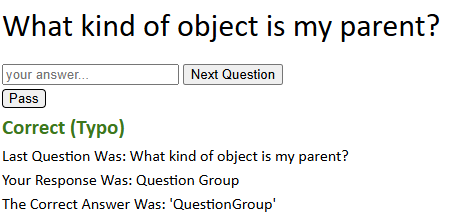
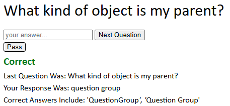
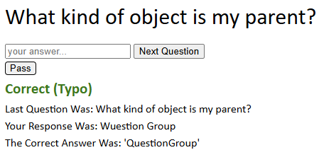
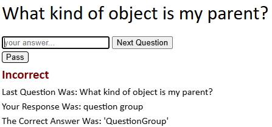
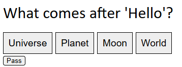
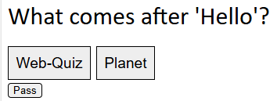
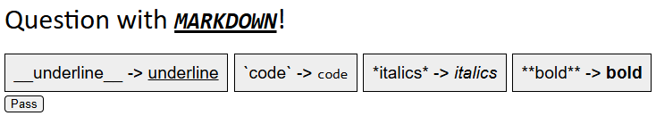

# Quiz Authorship Quickstart

This document is designed to teach you the basics of writing quiz files. Quiz files have advanced features that will be mentioned but not covered in this document. To learn about them, look at the "Library Save Format" specification in the readme, which goes into excruciating detail.

This document asumes you are familiar with the user interface and its basic features.

A hierarchical organization of questions into groups with unique properties is called a "Library". Library files are written in JSON and can be imported into the Web-Quiz page. The format is currently subject to change in the future.

## The Library Object

The root object is called a library, it looks like this:

```
{
	"version": 1,
	"author": "ekobadd",
	"title": "CompTIA A+ Certification 220-1101 (Core 1)",
	"question-root": ...
}
```

Only the `version` and `question-root` fields are required. This quickstart will use version 1. Additional fields allow you to tweak the default behavior of the quiz, such as how quickly it adapts to user progress or how difficult it is. These won't be covered in the quickstart, however.

### The `question-root`

The `question-root` must be a `QuestionGroup` object. QuestionGroup objects are a collection of other `QuestionGroup`s or of `Question`s, but never both. It is the root of a hierarchy of groups that the user can select or deselect.
A user cannot toggle individual questions, only QuestionGroups, so they should be used to organize questions into small blocks that the user may want to include or omit as a whole unit.
For now, however, we will merely place all our questions directly into this group.

## Question Objects

Here's an example where the `question-root` contains only three brief questions:

```
"question-root": {
	"What comes after hello?": "World",
	"What kind of object am I?": "Question",
	"What kind of object is my parent?": "QuestionGroup"
}
```

As you can see, the questions take the simple form of `"question": "answer"`. You already have enough knowledge to create a small library of some questions that require verbatim answers. By default, they are case-insensitive and even have a low level of typo forgiveness, which we'll go over later. The third question, for example, allows the user to make a single error.

If the user answers "Question Group" (with a space), then the question will be marked correct, which will influence the system's internal evaluation of their mastery over the material, and depending on the settings this information can influence what questions they see later. The user will be informed that the system has identified their answer as a correct answer with a typo.



Maybe this is not the behavior you like, maybe you think that "Question Group" is a *perfectly* acceptable answer and that the answer should not be thought of as typo'd. Moreover, you'd like the user to be able to give the answer with an additional typo, like "Wuestion Group", and still be marked correct. There are two ways to do this.

First, you can add "Question Group" as an additional answer, like so.

```
"What kind of object is my parent?": ["QuestionGroup", "Question Group"]
```

We've replaced the single answer with multiple answers in a list. Both answers are considered correct. After the user submits an attempt to this question, they will see both of these answers as valid options.



If you're thinking that you want the user to *be able to* answer "Question Group", but that it's not a canonical answer *per se*, just an alternative spelling, and you don't think it should actually be shown to the user, then you want to use second option: the `hidden-answers` field. In order to use this field or any field other than `question` and `answers`, we'll need to switch to **embedded-explicit** form.

### Question Forms

So far, we've been writing each question as a JSON key-value pair. It has been implicitly understood that the key is the question and the value is the answer or list of answers. Thus, this is called **implicit** form. The equivalent in **embedded-explicit** form is

```
"What kind of object is my parent?": {"answers": ["QuestionGroup", "Question Group"]}
```

There's also an **explicit** form, which won't be covered because it's never necessary and is mostly present as a formality.

### `hidden-answers`

As you can see in the example, the `answers` are now explicitly labeled as such inside of a container object. We can add our `hidden-answers` in next to it.

```
"What kind of object is my parent?": {
	"answers": "QuestionGroup",
	"hidden-answers": "Question Group"
}
```

Below, we see an image where a user has made a typo while attempting to type "Question Group" with a space. They are marked correct and have been informed of their typo. If we didn't add the hidden answer, this would have been marked as incorrect since it would have been marked as having two typos, which is too many for this particular question.



Additionally, we see that the user is nonetheless only shown the one canonical answer. Also note that, just like the `answers` field, the `hidden-answers` field will also accept multiple values in a list rather than a single string.

### `typo-blacklist`

Maybe for the purposes of your library you assert that the user should *not* be able to answer "Question Group". The user ought to memorize the *correct* spelling, you say, arms folded and gaze sharp. Still, you don't want to eliminate the typo forgiveness completely. After all, typos happen, and getting marked incorrect for a mistaken keypress feels unfair.

For this purpose, we use the `typo-blacklist` field, which accepts a single entry or multiple entries in a list.

```
"What kind of object is my parent?": {
	"answers": "QuestionGroup",
	"typo-blacklist": "Question Group"
}
```



### `case-sensitive` and `typo-forgiveness-level`

These are both *inheritable* fields closely related to the interpretation of a user's answer. We can't understand inheritance until we understand groups. But for now, just know that you *can* specify the `case-sensitive` or `typo-forgiveness-level` fields on individual questions, but you very rarely will in practice.

`case-sensitive` determines whether the user must match an answer's case in order to be marked correct. It is `false` by default. If it is `true`, then a letter with the wrong case will be counted as a single typo. The typo-blacklist also respects case sensitivity. If a quesiton is case-sensitive, the user will see a warning of this beneath the question text.

`typo-forgiveness-level` is complicated and covered in great depth in the readme. Just know that it counts typos using the Levenshtein algorithm, counting an insertion, deletion, or substitution of a single character as one typo. Valid values are "none", "low", "medium", and "high", where the default is "low". The exact number of typos allowed depends on the length of the answer. "low" allows a single typo for answers of length 8 and an additional typo for every 15 characters of length, "medium" allows a typo at length 5 and another typo for every 10 characters, "high" allows a typo at only 3 characters and an additional typo for every 5 additional characters.

The following question requires the user to submit "World" *exactly*, any deviation will be marked incorrect.
```
"What comes after 'Hello'?": {
	"answers": "World",
	"case-sensitive": true,
	"typo-forgiveness-level": "none"
}
```

## Multiple Choice Questions

Trying to create a large library of multiple choice questions with the syntax I'm about to introduce would be quite grueling, so don't do that! Instead practice on individual questions. Once we've fleshed out the Question object, we can move on to the QuestionGroup object. This is where the format will really open up for us.

### `mode-of-presentation` & `incorrect-answers`

The `mode-of-presentation` determines how the user will answer the question. The default, where the user enters the answer into a text box, is called "verbatim". The other options are "flash-card", where the user *isn't* asked for an answer, they merely reveal it, and "multiple-choice", where the user is prompted to select one of many answers.

In addition to setting the type of the question to "multiple-choice", we also must provide some incorrect answers.
This can done with the `incorrect-answers` field, but this is not the only source of incorrect answers (nor the best in most cases).

```
"What comes after 'Hello'?": {
	"answers": "World",
	"mode-of-presentation": "multiple-choice",
	"incorrect-answers": ["Planet", "Moon", "Universe"]
}
```



#### Format Negotiation

When `mode-of-presentation` is an array of values, these are considered to be the author's list of presentations which are acceptable.
In the future, users will be able to set their preferences for question formats, which will filter and alter these lists, allowing the user to alter the presentation of your questions according to the formats that you list as acceptable.

`mode-of-presentation` currently accepts an array of values, but in practice only the first will ever be used until format negotiation is implemented.

### `max-choices` & `correct-answer-source`

If we add more incorrect answers, three will be chosen at random every time the question is generated, so four answers will be shown total.
If you prefer that more answers are shown, you can set `max-choices` to something over 4 (it's default). You can also set it to something lower than 4 for fewer options. If you set it to 1, only the correct answer will ever show, and the user willl be unable to submit an incorrect one.

You might also wonder, what correct answer is shown to the user when there are multiple answers? For starters, entries in `hidden-answers` are never shown. As for which of the normal answers are shown, this is governed by the `correct-answer-source`, which is "random" by default, picking a random answer each time the multiple choice question is generated. Alternatively, you can set it to "primary" to always show the *first* answer.

```
"What comes after 'Hello'?": {
	"answers": ["Web-Quiz", "World"],
	"mode-of-presentation": "multiple-choice",
	"incorrect-answers": ["Planet", "Moon", "Universe"],
	"max-choices": 2,
	"correct-answer-source": "primary"
}
```

Below, you can see that with a `max-choices` of 2, only two options are available. Additionally, although it isn't apparent in the image, the "correct" option will always be shown as "Web-Quiz" instead of "World" because `correct-answer-source` is "primary".



Honestly though, if you're using `"correct-answer-source": "primary"`, in all likelihood you should just move the non-primary answers to `hidden-answers`. At first these actions might sound identical, but this is not true because of format negotiation. Format negotiation allows the user to change the presentation of a question.

## Markdown Support

To round out our study of `Question` objects, I'll finish by mentioning markdown support. All text displayed to the user supports markdown, except the Library `title` and `author` fields. This includes the `question`, `answers` and `incorrect-answers` fields. Also the `label` field on QuestionGroup objects. You can use '\*' for italics, '\*\*' for bold, '\`' for code (monospace), and '__' for underlines. Be careful with that last one, since the underlines will conflict with the underlines that appear when using type-to-select on multiple choice questions (been meaning to fix that).

Below, note that the double reverse-solidus is in essence our escape character, since the single reverse solidus is a special character in JSON, and therefore must be escaped.

```
"Question with ***__`MARKDOWN`__***!": {
	"mode-of-presentation": "multiple-choice",
	"answers": ["\\**bold\\** -> **bold**"],
	"incorrect-answers": [
		"\\*italics\\* -> *italics*",
		"\\`code\\` -> `code`",
		"\\__underline\\__ -> __underline__"
	]
}
```



I'm hoping to really expand and improve the markdown system in the future.

## QuestionGroup Objects

QuestionGroup objects are containers for other QuestionGroups or for other Questions, but never both. They allow the Library to be arranged in a cascading, hierarchical fashion, and many of their properties trickle down into the questions they contain. These properties are called "inheritables". They are really the core feature that makes EWQ Libraries so powerful.

For now, we'll build a **flat** library - that's a library where all the QuestionGroups contain Questions (except the `question-root`). What we were doing before, where we don't have any QuestionGroups at all (again, except the `question-root`) is called a **simple** Library. Eventually, we'll move on to a **cascading** Library by looking at the way QuestionGroups and their child QuestionGroups behave.