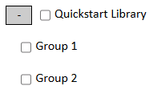
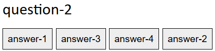

# Quiz Authorship Quickstart

This document is designed to teach you the basics of writing quiz files. Quiz files have advanced features that will be mentioned but not covered in this document. To learn about them, look at the "Library Save Format" specification in the readme, which goes into excruciating detail.

This document asumes you are familiar with the user interface and its basic features.

A hierarchical organization of questions into groups with unique properties is called a "Library". Library files are written in JSON and can be imported into the Web-Quiz page. The format is currently subject to change in the future.

## The Library Object

The root object is called a library, it looks like this:

```
{
    "version": 1,
    "author": "ekobadd",
    "title": "CompTIA A+ Certification 220-1101 (Core 1)",
    "question-root": ...
}
```

Only the `version` and `question-root` fields are required. This quickstart will use version 1. Additional fields allow you to tweak the default behavior of the quiz, such as how quickly it adapts to user progress or how difficult it is. These won't be covered in the quickstart, however.

### The `question-root`

The `question-root` must be a `QuestionGroup` object. QuestionGroup objects are a collection of other `QuestionGroup`s or of `Question`s, but never both. It is the root of a hierarchy of groups that the user can select or deselect.
A user cannot toggle individual questions, only QuestionGroups, so they should be used to organize questions into small blocks that the user may want to include or omit as a whole unit.
For now, however, we will merely place all our questions directly into this group.

## Question Objects

Here's an example where the `question-root` contains only three brief questions:

```
"question-root": {
    "What comes after hello?": "World",
    "What kind of object am I?": "Question",
    "What kind of object is my parent?": "QuestionGroup"
}
```

As you can see, the questions take the simple form of `"question": "answer"`. You already have enough knowledge to create a small library of some questions that require verbatim answers. By default, they are case-insensitive and even have a low level of typo forgiveness, which we'll go over later. The third question, for example, allows the user to make a single error.

If the user answers "Question Group" (with a space), then the question will be marked correct, which will influence the system's internal evaluation of their mastery over the material, and depending on the settings this information can influence what questions they see later. The user will be informed that the system has identified their answer as a correct answer with a typo.


Maybe this is not the behavior you like, maybe you think that "Question Group" is a *perfectly* acceptable answer and that the answer should not be thought of as typo'd. Moreover, you'd like the user to be able to give the answer with an additional typo, like "Wuestion Group", and still be marked correct. There are two ways to do this.

First, you can add "Question Group" as an additional answer, like so.

```
"What kind of object is my parent?": ["QuestionGroup", "Question Group"]
```

We've replaced the single answer with multiple answers in a list. Both answers are considered correct. After the user submits an attempt to this question, they will see both of these answers as valid options.


If you're thinking that you want the user to *be able to* answer "Question Group", but that it's not a canonical answer *per se*, just an alternative spelling, and you don't think it should actually be shown to the user, then you want to use second option: the `hidden-answers` field. In order to use this field or any field other than `question` and `answers`, we'll need to switch to **embedded-explicit** form.

### Question Forms

So far, we've been writing each question as a JSON key-value pair. It has been implicitly understood that the key is the question and the value is the answer or list of answers. Thus, this is called **implicit** form. The equivalent in **embedded-explicit** form is

```
"What kind of object is my parent?": {"answers": ["QuestionGroup", "Question Group"]}
```

There's also an **explicit** form, which won't be covered because it's never necessary and is mostly present as a formality.

### `hidden-answers`

As you can see in the example, the `answers` are now explicitly labeled as such inside of a container object. We can add our `hidden-answers` in next to it.

```
"What kind of object is my parent?": {
    "answers": "QuestionGroup",
    "hidden-answers": "Question Group"
}
```

Below, we see an image where a user has made a typo while attempting to type "Question Group" with a space. They are marked correct and have been informed of their typo. If we didn't add the hidden answer, this would have been marked as incorrect since it would have been marked as having two typos, which is too many for this particular question.


Additionally, we see that the user is nonetheless only shown the one canonical answer. Also note that, just like the `answers` field, the `hidden-answers` field will also accept multiple values in a list rather than a single string.

### `typo-blacklist`

Maybe for the purposes of your library you assert that the user should *not* be able to answer "Question Group". The user ought to memorize the *correct* spelling, you say, arms folded and gaze sharp. Still, you don't want to eliminate the typo forgiveness completely. After all, typos happen, and getting marked incorrect for a mistaken keypress feels unfair.

For this purpose, we use the `typo-blacklist` field, which accepts a single entry or multiple entries in a list.

```
"What kind of object is my parent?": {
    "answers": "QuestionGroup",
    "typo-blacklist": "Question Group"
}
```


### `case-sensitive` and `typo-forgiveness-level`

These are both *inheritable* fields closely related to the interpretation of a user's answer. We can't understand inheritance until we understand groups. But for now, just know that you *can* specify the `case-sensitive` or `typo-forgiveness-level` fields on individual questions, but you very rarely will in practice.

`case-sensitive` determines whether the user must match an answer's case in order to be marked correct. It is `false` by default. If it is `true`, then a letter with the wrong case will be counted as a single typo. The typo-blacklist also respects case sensitivity. If a quesiton is case-sensitive, the user will see a warning of this beneath the question text.

`typo-forgiveness-level` is complicated and covered in great depth in the readme. Just know that it counts typos using the Levenshtein algorithm, counting an insertion, deletion, or substitution of a single character as one typo. Valid values are "none", "low", "medium", and "high", where the default is "low". The exact number of typos allowed depends on the length of the answer. "low" allows a single typo for answers of length 8 and an additional typo for every 15 characters of length, "medium" allows a typo at length 5 and another typo for every 10 characters, "high" allows a typo at only 3 characters and an additional typo for every 5 additional characters.

The following question requires the user to submit "World" *exactly*, any deviation will be marked incorrect.
```
"What comes after 'Hello'?": {
    "answers": "World",
    "case-sensitive": true,
    "typo-forgiveness-level": "none"
}
```

## Multiple Choice Questions

Trying to create a large library of multiple choice questions with the syntax I'm about to introduce would be quite grueling, so don't do that! Instead practice on individual questions. Once we've fleshed out the Question object, we can move on to the QuestionGroup object. This is where the format will really open up for us.

### `mode-of-presentation` & `incorrect-answers`

The `mode-of-presentation` determines how the user will answer the question. The default, where the user enters the answer into a text box, is called "verbatim". The other options are "flash-card", where the user *isn't* asked for an answer, they merely reveal it, and "multiple-choice", where the user is prompted to select one of many answers.

In addition to setting the type of the question to "multiple-choice", we also must provide some incorrect answers.
This can done with the `incorrect-answers` field, but this is not the only source of incorrect answers (nor the best in most cases).

```
"What comes after 'Hello'?": {
    "answers": "World",
    "mode-of-presentation": "multiple-choice",
    "incorrect-answers": ["Planet", "Moon", "Universe"]
}
```


#### Format Negotiation

When `mode-of-presentation` is an array of values, these are considered to be the author's list of presentations which are acceptable.
In the future, users will be able to set their preferences for question formats, which will filter and alter these lists, allowing the user to alter the presentation of your questions according to the formats that you list as acceptable.

`mode-of-presentation` currently accepts an array of values, but in practice only the first will ever be used until format negotiation is implemented.

### `max-choices` & `correct-answer-source`

If we add more incorrect answers, three will be chosen at random every time the question is generated, so four answers will be shown total.
If you prefer that more answers are shown, you can set `max-choices` to something over 4 (it's default). You can also set it to something lower than 4 for fewer options. If you set it to 1, only the correct answer will ever show, and the user willl be unable to submit an incorrect one.

You might also wonder, what correct answer is shown to the user when there are multiple answers? For starters, entries in `hidden-answers` are never shown. As for which of the normal answers are shown, this is governed by the `correct-answer-source`, which is "random" by default, picking a random answer each time the multiple choice question is generated. Alternatively, you can set it to "primary" to always show the *first* answer.

```
"What comes after 'Hello'?": {
    "answers": ["Web-Quiz", "World"],
    "mode-of-presentation": "multiple-choice",
    "incorrect-answers": ["Planet", "Moon", "Universe"],
    "max-choices": 2,
    "correct-answer-source": "primary"
}
```

Below, you can see that with a `max-choices` of 2, only two options are available. Additionally, although it isn't apparent in the image, the "correct" option will always be shown as "Web-Quiz" instead of "World" because `correct-answer-source` is "primary".


Honestly though, if you're using `"correct-answer-source": "primary"`, in all likelihood you should just move the non-primary answers to `hidden-answers`. At first these actions might sound identical, but this is not true because of format negotiation. Format negotiation allows the user to change the presentation of a question.

## Markdown Support

To round out our study of `Question` objects, I'll finish by mentioning markdown support. All text displayed to the user supports markdown, except the Library `title` and `author` fields. This includes the `question`, `answers` and `incorrect-answers` fields. Also the `label` field on QuestionGroup objects. You can use '\*' for italics, '\*\*' for bold, '\`' for code (monospace), and '__' for underlines. Be careful with that last one, since the underlines will conflict with the underlines that appear when using type-to-select on multiple choice questions (been meaning to fix that).

Below, note that the double reverse-solidus is in essence our escape character, since the single reverse solidus is a special character in JSON, and therefore must be escaped.

```
"Question with ***__`MARKDOWN`__***!": {
    "mode-of-presentation": "multiple-choice",
    "answers": ["\\**bold\\** -> **bold**"],
    "incorrect-answers": [
        "\\*italics\\* -> *italics*",
        "\\`code\\` -> `code`",
        "\\__underline\\__ -> __underline__"
    ]
}
```


I'm hoping to really expand and improve the markdown system in the future.

## QuestionGroup Objects

QuestionGroup objects are containers for other QuestionGroups or for other Questions, but never both. They allow the Library to be arranged in a cascading, hierarchical fashion, and many of their properties trickle down into the questions they contain. These properties are called "inheritables". They are really the core feature that makes EWQ Libraries so powerful.

For now, we'll build a **flat** library - that's a library where all the QuestionGroups contain Questions (except the `question-root`). What we were doing before, where we don't have any QuestionGroups at all (again, except the `question-root`) is called a **simple** Library. Eventually, we'll move on to a **cascading** Library by looking at the way QuestionGroups and their child QuestionGroups behave together.

Here's a definition of a couple simple groups inside of the `question-root`:

```
"question-root": {
    "Group 1": {
        "question-1": "answer-1",
        "question-2": "answer-2"
    },
    "Group 2": {
        "question-3": "answer-3",
        "question-4": "answer-4"
    }
}
```

If you load a library with the above `question-root`, you'll see that the root item can now be expanded to show our two groups, which can be selected separately.



These groups are in **implicit form**. Remember, an implicit *Question* allows you to specify only two fields: `question` and `answers`. In order to add more, you need to write that question in **embedded-explicit form**.

An implicit *QuestionGroup* is a bit different. The key always specifies the `label` field. The value specifies either the `questions` field or the `groups` field. The parser infers which by checking the form of the body! Remeber, `question-root` is a QuestionGroup too, and it is also in implicit form (has been for the entirety of this tutorial), except now it has groups for children. So how does the parser figure out what's going on here? To answer that, lets look at the same library, except that all three groups are in embedded-explicit form:

```
"question-root": {"groups": {
    "Group 1": {"questions": {
        "question-1": "answer-1",
        "question-2": "answer-2"
    }},
    "Group 2": {"questions": {
        "question-3": "answer-3",
        "question-4": "answer-4"
    }}
}}
```

Not a lot different, except that the body of each group now explicitly has either the `questions` or `groups` field (just like how our first embedded-explicit Question only had the `answers` field inside). When the parser looked at the implicit version of `question-root`, it saw that both of these `questions` and `groups` fields were missing. At least one of them must be present in a group, so it assumed that `question-root` must be in implicit form. Note that this assumption could produce some unexpected errors if you intended for the group to be in embedded-explicit form but forgot or misspelled a required field.

### Child Type Deduction & The Big Honking Error You Might've Already Seen

After concluding that `question-root` was in implicit form, it knew that the body is *either* going to be a list of groups or a list of questions. It started by assuming that the list was a list of questions. If so, then `Group 1` must be in embedded-explicit form, since an implicit question would have a *string* for a body, not an *object* like `Group 1` has. It looked inside that body and saw that the required `answers` field is missing. If indeed this is question, it concluded, it is malformed. It backtracked and tried to re-interpret the body of `question-root` as a list of QuestionGroups instead. Then it went through the whole process again with group 1. It saw the missing `questions` and `groups` fields, concluded that `Group 1` was in implicit form, attempted to interpret its key-value pairs as questions, and succeeded! The key-value pairs are both Question objects in implicit form, as the human-readable names imply. If it had been unsuccessful in both interpretations, it would've had an error code for *each* failure. These errors codes are combined into a big error code like the one shown below.


If we look at the code that caused this mess, we see that the issue is really quite simple:

```
"question-root": {
    "Group 1": {
        "question-1": "answer-1",
        "question-2": {"answerd": "<- typo"}
    }
}
```

The second question is suppposed to be in embeded-explicit form but the required field has a typo. If it weren't for the first question's existince, the parser would interpret `question-2` as a group with a single implicit question.

The three lines at the bottom are our actual errors. Look at the bottom one. It begins:

> "While interpreting **Question** ... Group 1 ..."

We, the human authors, can read the title and infer that "Group 1" is very clearly meant to be a group, not a question. This error was generated while the parser was attempting to interpret "Group 1" the wrong way. We can ignore it completely. Now look at the next error up from the bottom.

> "While interpreting **QuestionGroup** ... question-1 ..."

Again, the parser was on the wrong track when it generated this error. It was trying to interpret "Group 1" as a group of groups. Way off! This error gets thrown out too. Now for the next one up.

> "While interpreting **Question** ... question-2 ..."

Now we're on to something! The parser failed to interpret our question while actually trying to interpret it the way we meant it to. The error continues: "required parameter 'answers' is missing." Upon a not-so-close inspection, we can confirm that this is true.

If you're ever stuck on one of these, convert the suspect groups into embedded-explicit form by explicitly specifying whether its children are Questions or QuestionGroups. Then the parser will not have any guesswork and can give you only the error that matters to you.

```
"question-root": {"groups": {
    "Group 1": {"questions": {
        "question-1": "answer-1",
        "question-2": {"answerd": "<- typo"}
    }}
}}
```


Library files aren't the epitome of nuance and complexity but they aren't simple either! Practice will make you quite skilled at picking these errors apart.

### Inheritables

Most inheritables are fields we've already learned, like `max-choices` and `incorrect-answers`. You can add these on a group. They don't affect the group itself. Instead, they trickle down and are *inherited* by the group's children. This allows us to label many questions at once! And we can use groups to apply different properties to different problem sets. The other inheritables we know are `typo-forgiveness-level`, `case-sensitive`, and `correct-answer-source`.


```
"Group 1": {
    "mode-of-presentation": "multiple-choice",
    "max-choices": 3,
    "incorrect-answers": ["incorrect-1", "incorrect-2", "incorrect-3"],
    
    "questions": {
        "question-1": "answer-1",
        "question-2": {"answers": "answer-2", "max-choices": 2}
    }
}
```

Here, we've specified "Group 1" in embedded-explicit form, with the `questions` parameter, so we can add additional parameters.
The `mode-of-presentation` and `max-choices` options are inherited by the children. The second child, however, overrides the value of `max-choices`. This question will have two choices (one correct, one incorrect). The other will have three. Remember, the default (if `max-choices` isn't specified anywhere in the hierarchy) is 4.

You can also see that they share a source of incorrect answers. The `incorrect-answers` field doesn't get inherited the same way as other fields. Instead of being overridden, it gets *concatenated* - the contributions of the question and all its ancestors are all combined into one big list of available incorrect answers.

The "ancestors" of a question are its containing group, its group's containing group, its group's group's group, all the way up to the root. Conversly, the "descendants" of a group include all its children, grandchildren, and so on down to all the questions.

Another source of incorrect answers exists and is very powerful: The *correct* answers to *other* questions. In order to use these, we set the `descendants-share-incorrect-answers` field to true. This field doesn't get inherited. A more apt word might be "masked", but we won't delve into that until we're building cascading libraries. Instead, just observe the magic:

```
"group-1": {
    "mode-of-presentation": "multiple-choice",
    "descendants-share-incorrect-answers": true,
    
    "questions": {
        "question-1": "answer-1",
        "question-2": "answer-2",
        "question-3": "answer-3",
        "question-4": "answer-4"
    }
}
```



It is often a good idea to group questions by the kind of answer they ask for in the first place. Often, a library designed with only "verbatim" presentation in mind is easily converted to a library that supports "multiple-choice" presentation, with the help of the `descendants-share-incorrect-answers` field. These options will be concatenated to any provided in an `incorrect-answers` field.

If the exact same incorrect answer is available via mutliple sources, for example if multiple questions have the same answer in a group with `"descendants-share-incorrect-answers": true`, then this incorrect answer will be *more likely* to appear than others, but they will never both appear at the same time. Also, the system will never accidentally pick a correct answer and display it as an incorrect answer. These issues are prevented by a sanity check performed on the randomly generated incorrect answers right before they're displayed. If it finds that one of the "incorrect" answers would actually be graded as correct, it throws it out and generates a new one.

## Cascading Libraries

As previously mentioned, groups can have groups for children, not just questions. This structure allows a user to vary the amount of granularity with which they control their own experience. They can check the first box and leave it all up to the author, or expand out each individual group and inspect them one at a time, and everything in between.

In order to create cascading libraries, the first thing you must understand is that inheritance can occure *through* groups.

```
{
    "version": 1,
    "author": "ekobadd",
    "title": "Quickstart Library",
    "question-root": {
        "Outer Group": {
            "mode-of-presentation": "multiple-choice",
            "incorrect-answers": ["incorrect-1", "incorrect-2"],
            "max-choices": 3,
            
            "groups": {
                "Inner Group 1": {
                    "question-1": "answer-1",
                    "question-2": "answer-2"
                },
                
                "Inner Group 2": {
                    "incorrect-answers": "incorrect-3",
                    "max-choices": 4,
                    
                    "questions": {
                        "question-3": "answer-3",
                        "question-4": "answer-4"
                    }
                }
            }
        }
    }
}
```

Not including the `question-root` itself, we have three groups. "Outer Group" has the `groups` field within it, so we know right away that it is in embedded-explict form and has groups for children. "Inner Group 2" has the `questions` field so we know that it's in embedded-explicit form and has questions for children. "Inner Group 1" has neither so we know that it's in implicit form. We can tell by the names of the keys that they are questions, the parser can tell they are questions in implicit form because the values ("answer-1" and "answer-2") are strings.

The Outer Group specifies the `mode-of-presentation` for the entire library, since it's not overridden by either of the inner groups or any of the questions. `max-choices` is 3 for the first two questions, it's inherited the same way as `mode-of-presentation`. For the last two questions, they *would* inherit the same way, if not for the fact that "Inner Group 2" - an intermediary - overrides that value and sets it to 4. "Inner Group 2" also specifies a single incorrect answer. But remember that `incorrect-answers` is not inherited normally. The `incorrect-answers` field in Inner Group 2 does not override the existing incorrect answers, but appends to it. The last two questions both have three available incorrect answers.

Since inheritance can pull through groups, you can set default settings on the entire library by setting them on the root.

### `descendants-share-incorrect-answers` on a Cascading Library

It can help a lot to understand how this field works in bigger libraries. It is not inherited. Instead, answers are shared between questions whose nearest anscestor with `"descendants-share-incorrect-answers": true` are the same.

Maybe that's confusing. Think about groups as "scooping up" all the answers of the questions that descend from them.
This is the same language, conceptually, that the program's code uses to reference this field. A group with this field set to true is called an **answer claimant**.

Once the answers have been claimed, they can't be claimed again - and subsequently shared by - the ancestors of the claimant. Here's an example:

```
"Outer Group": {
    "mode-of-presentation": "multiple-choice",
    "descendants-share-incorrect-answers": true,
    
    "groups": {
        "Inner Group 1": {
            "question-1": "answer-1",
            "question-2": "answer-2"
        },
        
        "Inner Group 2": {
            "question-3": "answer-3",
            "question-4": "answer-4"
        },
        
        "Inner Group 3": {
            "descendants-share-incorrect-answers": true,
            
            "questions": {
                "question-5": "answer-5",
                "question-6": "answer-6"
            }
        }
    }
}
```

Here, the "Outer Group" has `"descendants-share-incorrect-answers": true`, it's an answer claimant. So, you might think that all of the answers to these questions can appear as incorrect answers to all the other questions, but this is not the case. The answers to questions 5 and 6 have been claimed by Inner Group 3, which is also an answer claimant. They are not available to be claimed by the Outer Group and therefore will not be present on the questions outside of this group; only to each other.


In the above image, you can see the options available to question-1. No other options are available.

In addition, when searching for an ancestor who is an answer claimant from which to generate incorrect answers, a question will only search until the first answer claimant it finds. So question-6, for example, will grab it's incorrect answers from the first answer claimant it finds which also happens to be its immediate parent: Inner Group 3. It will not see the answers claimed by the Outer group. The only incorrect answer on question-6 is answer-5.


### `hidden`

The `hidden` field is handy for logically organizing groups internally in a way that is handy for the author but more-or-less meaningless for the user. A hidden group is not visible or selectable by the user. It's not inherited *per se*, but a hidden group's children will not be rendered either. A hidden group will still be selected if any of its ancestors are selected.

An excellent example can be found in the CompTIA A+ Core 2 Library:

```
"Navigation": {
	"cd": {
		"hidden": true,
		"descendants-give-incorrect-answers": true,
		"incorrect-answers": ["`cd`", "`chdir`"],
		"questions": {
			"In Windows, what command would change the working directory to the root of the current drive?": {"answers": "`cd \\\\`", "hidden-answers": "cd /"},
			"In Windows, what command would change the working directory to the parent of the current working directory?": "`cd ..`"
		}
	},
	"other": {
		"hidden": true,
		"questions": {
			"In Windows, what command is used to change the working directory?": ["`cd`", "`chdir`"],
			"In Windows, what command is used to get a list of files and folders in the current working directory?": "`dir`",
			"In Windows, what command is used to make a directory?": ["`md`", "`mkdir`"],
			"In Windows, what command is used to remove a directory?": ["`rd`", "`rmdir`"]
		}
	}
},
```

You can't see it, but the parent of the "Navigation" group is an answer claimant, so the hidden "cd" group was made to prevent the incorrect answers of that group from appearing on those questions. The "other" group is just a container for the rest of the questions in this group which should still inherit the normal settings. The groups are hidden because users aren't gonna want to learn *only* `cd \` and `cd ..` to the exclusion of `cd` and the other navigation commands. To give them that option would be arbitrary and would only introduce clutter.

Oh, the quadruple backslash? A single backslash would begin a JSON escape sequence which would cause an error. A double backslash would resolve to a single backslash which would escape the backtick markdown character. We need the quadruple backslash in this case only because it just so happens to appear right before a markdown token...